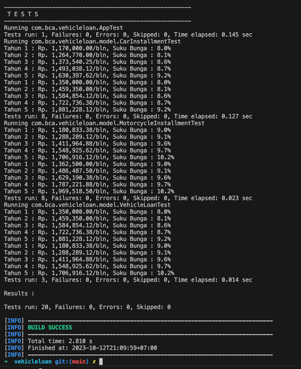
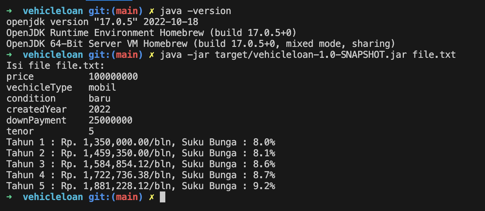
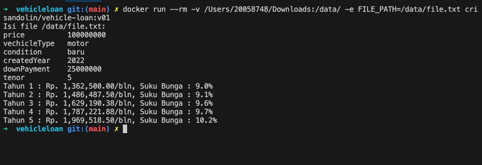
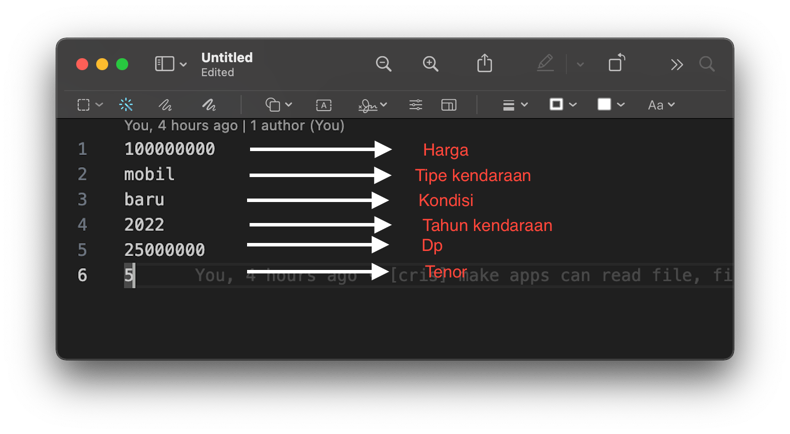

# Vehicle Loan

## Install Maven
1. Pastikan sudah memiliki maven pada local computer, jika belum ada dapat di download terlebih dahulu di https://maven.apache.org/download.cgi 
dan install https://maven.apache.org/install.html.
2. Jika sdkman sudah terinstall pada laptop anda, anda dapat menggungkan ``sdk install maven`` untuk menginstall maven versi terbaru.
3. Bisa juga dengan menginstall maven melalui brew ``brew install maven``

# Install Java17
Java 17 dapat diinstall menggunakan sdkman maupun brew.

## Running Unit Test
Apabila maven sudah terinstall pada laptop anda, anda bisa masuk kedalam project, lalu run command
``mvn clean test`` untuk mengeksekusi semua unit test


## Run Project dengan Jar

Apabila sudah mempunyai java 17 dan sudah diset sebagai default running java,
jar file dapat dieksekusi dengan ``java -jar vehicleloan-1.0-SNAPSHOT.jar file.txt``


## Run Project dengan Docker
```
docker run --rm -v ${PATH_FILE}:/data/ -e FILE_PATH=/data/${NAME_FILE} crisandolin/vehicle-loan:v01
```

### contoh:
```
docker run --rm -v /Users/20058748/Downloads:/data/ -e FILE_PATH=/data/file.txt crisandolin/vehicle-loan:v01
```


## Text file input Format


## Asumsi Pengerjaan
1. Pada soal terdapat rules of the game berikut:
```agsl
3. Jumlah DP Mobil/Motor Baru >= 35%  Jumlah Pinjaman
x
4. Jumlah DP Mobil/Motor Baru >= 25%  Jumlah Pinjaman
```
Saya menggunakan 25% untuk kondisi baru, sendangkan bekas menggunakan 35%. Asumsi diambil karena pada contoh excel 
dan http://www.mocky.io/v2/5d06e6ae3000005300051d16 kondisi baru menggunakan 25%.

2. Soal tidak dipublikasikan tetapi kode dan docker image dipush ke gitlab dan docker hub.
```agsl
Share to us your GitHub or gitlab link as your project and your CI script are also attach.
x
MANDATORY: Please do not make this problem statement publicly available by, for example, using GitHub or bitbucket or by posting this problem to a blog or forum.
```


